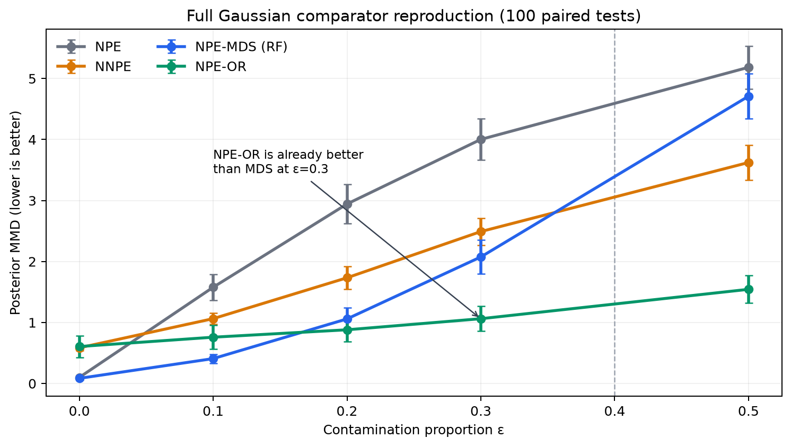
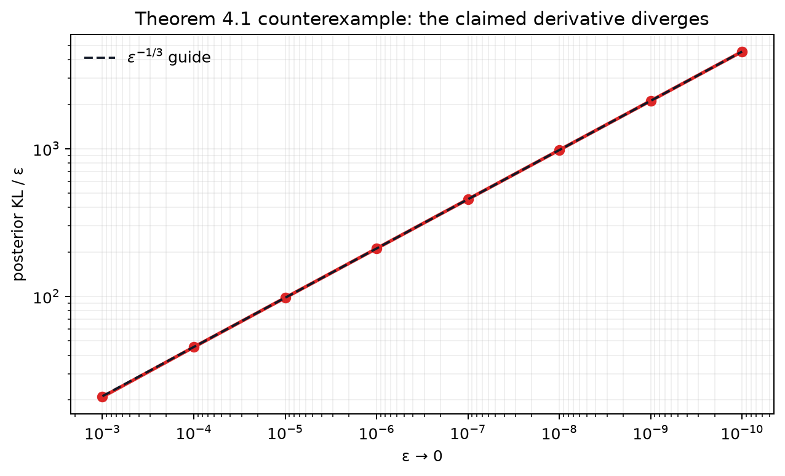
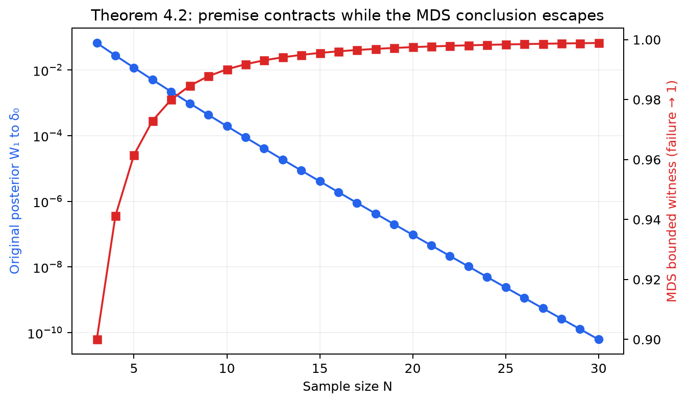
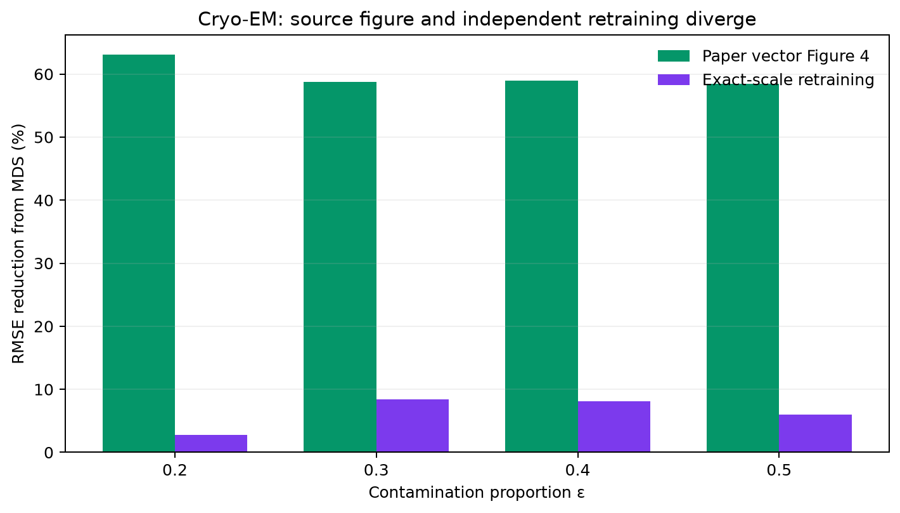

# Minimum Distance Summaries — claim-by-claim CPU reproduction



The central question is whether Minimum Distance Summaries (MDS) can make a
pretrained neural posterior robust at test time without retraining it. The
method does work as a plug-in: the neural posterior stays frozen while MDS
changes only the query summary. But the evidence is more conditional than a
single robustness curve suggests. On the full Gaussian comparator experiment,
MDS beats ordinary NPE and NNPE through 30% contamination, while the
outlier-removal baseline NPE-OR is already decisively better at 30%. Two
printed theoretical claims admit exact-assumption counterexamples. The
1024-dimensional Cryo-EM result remains BLOCKED after four routes because an
exact-scale retraining and the authors' displayed Figure 4 disagree.

The live evaluator score is still **7/12**. The best-supported forecast after
publication is **10/12**, not a judge result.

## What the implementation changes at test time

The offline path trains two independent objects:

1. a conditional neural posterior \(q_\psi(\theta\mid s)\); and
2. a decoder mean-embedding network that predicts Gaussian-kernel random
   Fourier features for a candidate summary.

At test time, the official adapter uses L-BFGS with strong-Wolfe line search
to minimize the feature-space MMD between the observed data and decoder
output. The optimized summary is passed into the frozen posterior. Tensor
SHA-256 checks before and after all adaptations make the separation
machine-checkable.

The cumulative command is identical on every experiment node:

```text
git submodule update --init --recursive && uv sync --frozen && uv run python reproduction/run_all.py
```

Python 3.12, one repository `.venv`, and the committed `uv.lock` are used
throughout. All nontrivial computation ran on Hugging Face `cpu-upgrade`; no
GPU was used.

## Gaussian: robust against NPE, not every comparator

The experiment matches the paper-scale Gaussian design: 50,000 training
datasets, 100 paired tests, 100 observations, two dimensions, 2,000 posterior
samples, 512 RFFs, contamination `{0,.1,.2,.3,.5}`, and all four methods.
The metric is five-bandwidth posterior MMD to the analytic clean posterior.

| epsilon | NPE | NNPE | NPE-MDS | NPE-OR |
| ---: | ---: | ---: | ---: | ---: |
| 0.0 | 0.1002 | 0.5855 | **0.0846** | 0.6063 |
| 0.1 | 1.5784 | 1.0635 | **0.4084** | 0.7594 |
| 0.2 | 2.9438 | 1.7338 | 1.0591 | **0.8810** |
| 0.3 | 4.0026 | 2.4915 | 2.0756 | **1.0626** |
| 0.5 | 5.1841 | 3.6236 | 4.7103 | **1.5444** |

At epsilon 0.3, the paired NPE-OR-minus-MDS difference is `-1.0129`; its
10,000-replicate 95% bootstrap interval is `[-1.3538,-0.6719]`. That
falsifies the stronger imported claim that MDS beats every named comparator
below 40% contamination. It does not falsify the paper's qualified wording
that MDS is better “in general.” The disabled-adaptation control exits
nonzero, all 11 independent integrity checks pass, and both learned posterior
hashes remain frozen.

## Theorem 4.1: a flat objective breaks the influence bound



Theorem 4.1 universally bounds the right derivative at zero of posterior KL
under point-mass contamination. The counterexample uses the printed summary
domain, a Gaussian decoder and kernel, a symmetric two-point target, and a
bounded exact posterior. All ten printed assumptions pass, including the
paper-defined positive model-averaged Hessian. The actual target-objective
Hessian is nevertheless zero, producing a quartically flat minimum.

The adapted summary moves as \(\epsilon^{1/3}\), so
KL/\(\epsilon\) grows as \(\epsilon^{-1/3}\). It rises from `20.87` at
epsilon `1e-3` to `4547.80` at `1e-10`. Independent symbolic/numeric
reconstruction recovers the constants and slopes. A correctly specified
Gaussian control has a positive target Hessian, KL/epsilon tends to zero,
and the falsification verifier exits nonzero as intended.

## Theorem 4.2: bounded ISPD is not enough for weak convergence



Theorem 4.2 claims that original-summary posterior consistency implies
MDS-summary consistency. The exact conditional construction is correctly
specified on a closed, locally compact countable subset of the real line. Its
bounded continuous kernel is integrally strictly positive definite, and all
printed assumptions pass.

The original posterior contracts to the truth—its Wasserstein distance falls
from `6.67e-2` at sample size 3 to `6.21e-11` at 30. MDS instead selects an
escaping point mass. The bounded continuous witness tends to one rather than
its value zero at the truth. The missing condition is the stronger
\(H_k\subset C_0\) topology needed for MMD to metrize weak convergence.
A Gaussian-\(C_0\) negative control blocks the escape and exits nonzero.

## Cryo-EM: a scientifically important unresolved discrepancy



The paper's vector Figure 4 displays 58–63% RMSE reductions at epsilon
0.2–0.5. An independent exact-scale run used 15,000 training datasets, 100
tests, 100 32×32 images per test, 20 states, 2,000 posterior samples and
1,024 RFFs. It observed only 2.8–8.5% reductions and worse clean performance.

Three additional routes did not turn that discrepancy into a defensible
verdict:

- exhaustive normalization over all 20 states improved epsilon 0.2–0.4 but
  regressed at 0.5;
- vector-path reconstruction verified all 48 displayed Figure 4 values but
  is source evidence, not an independent experiment;
- the mandatory falsification audit rejected a different training seed, one
  worst query, and an altered algorithm/noise model as invalid
  counterexamples to a finite empirical report.

Claim 6 is therefore **BLOCKED**, not falsified. The concrete unblocker is the
authors' exact saved checkpoint and Figure 4 training/test realization, or an
explicit universal quantifier over retraining realizations.

## Claim assessment

| Claim | Evidence verdict | Assessment | Compute |
| --- | --- | --- | --- |
| 1 — frozen plug-in separation | VERIFIED | Directly aligned | Cumulative HF CPU |
| 2 — official RFF/L-BFGS implementation | VERIFIED | Directly aligned, packaging caveats disclosed | Cumulative HF CPU |
| 3 — Theorem 4.1 | FALSIFIED | Exact universal counterexample | Sub-second route inside cumulative HF CPU |
| 4 — Theorem 4.2 | FALSIFIED | Exact implication counterexample | Sub-second route inside cumulative HF CPU |
| 5 — Gaussian all-comparator gloss | FALSIFIED | MDS helps, but NPE-OR is better before 40% | 1,655.65 s, HF CPU |
| 6 — Cryo-EM | BLOCKED | Paper vector and exact-scale retraining diverge | Four HF CPU routes |

## Experiment lineage and reproducibility

The scientific winner is
[`orx/integrated-claims-1-6-cumulative-evidence`](https://github.com/MachineLearning-Nerd/icml26-repro-lq8fNVME8v-mds/tree/orx/integrated-claims-1-6-cumulative-evidence)
at `41ec2e32d267e6944c04cc766c495f59a3071fdb`. Its formal run
`fd04a075-47dd-487c-a947-c6972227a67b` completed in 1,709.11 seconds,
exposed 64 logical CPUs for an estimated six useful cores, and used no GPU.
Across all 14 recorded HF jobs through that winner—including setup failures
retained for provenance—the scheduler accumulated 16,418 seconds (4.5606
job-hours). At the 2026-07-26 `cpu-upgrade` catalog price of $0.03/hour, the
listed compute cost was $0.1368.

The important branches are:

- [exact theorem integration](https://github.com/MachineLearning-Nerd/icml26-repro-lq8fNVME8v-mds/tree/orx/integrated-exact-theorem-falsifications);
- [full Gaussian comparators](https://github.com/MachineLearning-Nerd/icml26-repro-lq8fNVME8v-mds/tree/orx/full-gaussian-comparator-reproduction);
- [full Cryo-EM route](https://github.com/MachineLearning-Nerd/icml26-repro-lq8fNVME8v-mds/tree/orx/full-1024d-cryo-em-reproduction);
- [discrete-state Cryo route](https://github.com/MachineLearning-Nerd/icml26-repro-lq8fNVME8v-mds/tree/orx/cryo-discrete-state-posterior-verification);
- [Figure 4 reconstruction](https://github.com/MachineLearning-Nerd/icml26-repro-lq8fNVME8v-mds/tree/orx/cryo-figure-4-vector-reconstruction);
- [mandatory falsification qualification](https://github.com/MachineLearning-Nerd/icml26-repro-lq8fNVME8v-mds/tree/orx/cryo-mandatory-falsification-qualification).

Two Gaussian setup failures were environmental and produced no claim
evidence: one image lacked `uv`, and the authors' eager initializer imported
an undeclared incompatible optional package. The final implementation imports
the pinned official modules without that unrelated initializer. The first
Cryo route's job status is failed only because its fail-closed `BLOCKED`
verifier exited `1` after producing the complete scientific evidence; later
wrappers preserve nonzero verifier evidence without failing the orchestration
job.

The full evaluator-facing raw data, executable checkers, controls and exact
limitations are in the existing Hugging Face logbook candidate. The current
live judged score remains 7/12 until the evaluator records a new revision.
